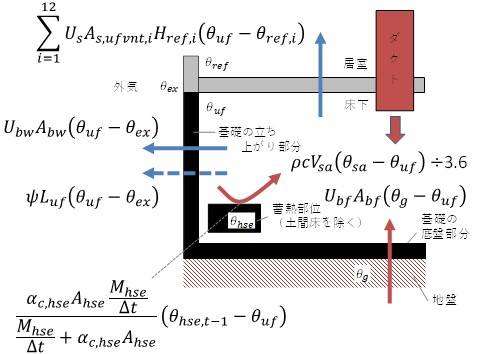

# 床下空間の熱収支

集熱後の空気を供給する床下空間の熱収支式は、式(1)により表される。

$$
\begin{align*}
    \rho_{air}c_{P_{air}} V_{sa,d,t} \left( \theta_{sa,d,t} - \theta_{uf,d,t} \right) & \div 3600 \times 10^{3} + U_{bf} A_{s,ufvnt,A} \left( \theta_{g,d,t} - \theta_{uf,d,t} \right) + \alpha_{c,hse} A_{hse}  \left( \theta_{hse,d,t} - \theta_{uf,d,t} \right)\\
    &= \sum_{i=1}^{12} U_{s} A_{s,ufvnt,i} \left( \theta_{uf,d,t} - \theta_{in,d,t,i} \right) + U_{bw} A_{bw} \left( \theta_{uf,d,t} - \theta_{ex,d,t} \right) + \psi L_{uf} \left( \theta_{uf,d,t} - \theta_{ex,d,t} \right)
\end{align*}
$$

 (1) 

日付$d$の時刻$t$における暖冷房区画$i$の室温は、暖房運転の発生の有無に応じて、式(2)により表される。

暖房時：

$$
\begin{equation*}
    \theta_{in,d,t,i} = \theta_{prst,H}
\end{equation*}
$$

 (2-1) 

非暖房時：

$$
\begin{equation*}
    \theta_{in,d,t,i} = H_{floor}\theta_{ex,d,t} + \left( 1-H_{floor} \right) \theta_{uf,d,t}
\end{equation*}
$$

 (2-2) 

便宜上、日付$d$の時刻$t$において暖冷房区画$i$に関する計算を行う際に参照する空間の空気温度を $\theta_{ref,d,t}$、温度差係数を $H_{ref,d,t}$ とすると、式(2)は式(2')のように整理できる。

式(2)⇔

$$
\begin{equation*}
    \theta_{in,d,t,i} = H_{ref,d,t,i} \theta_{ref,d,t,i} + \left( 1-H_{ref,d,t,i} \right) \theta_{uf,d,t}
\end{equation*}
$$

　　⇔

$$
\begin{equation*}
    \theta_{in,d,t,i} - \theta_{uf,d,t} = H_{ref,d,t,i} \left(\theta_{ref,d,t,i} - \theta_{uf,d,t} \right)
\end{equation*}
$$

 (2') 

暖房時：

$$
\begin{equation*}
    \theta_{ref,d,t,i} = \theta_{prst,H}
\end{equation*}
$$

 (2'a-1) 

$$
\begin{equation*}
    H_{ref,d,t,i} = 1
\end{equation*}
$$

 (2'b-1) 

非暖房時：

$$
\begin{equation*}
    \theta_{ref,d,t,i} = \theta_{ex,d,t}
\end{equation*}
$$

 (2'a-2) 

$$
\begin{equation*}
    H_{ref,d,t,i} = H_{floor}
\end{equation*}
$$

 (2'b-2) 

式(2')を式(1)に代入すると、式(1')が得られる。

$$
\begin{align*}
    \rho_{air}c_{P_{air}} V_{sa,d,t} \left( \theta_{sa,d,t} - \theta_{uf,d,t} \right) & \div 3600 \times 10^{3} + U_{bf} A_{s,ufvnt,A} \left( \theta_{g,d,t} - \theta_{uf,d,t} \right) + \alpha_{c,hse} A_{hse}  \left( \theta_{hse,d,t} - \theta_{uf,d,t} \right)\\
    &= \sum_{i=1}^{12} U_{s} A_{s,ufvnt,i} H_{ref,i,d,t} \left( \theta_{uf,d,t} - \theta_{ref,i,d,t} \right) + U_{bw} A_{bw} \left( \theta_{uf,d,t} - \theta_{ex,d,t} \right) + \psi L_{uf} \left( \theta_{uf,d,t} - \theta_{ex,d,t} \right)
\end{align*}
$$

 (1') 

土間床を除いた床下蓄熱部位（基礎梁等）の熱収支式は、式(3)により表される。

$$
\begin{equation*}
    M_{hse}  \frac{\left( \theta_{hse,d,t} - \theta_{hse,d,t-1} \right)}{\Delta t} = \alpha_{c,hse} A_{hse} \left( \theta_{uf,d,t} - \theta_{hse,d,t} \right)
\end{equation*}
$$

 (3) 

式(3)から、日付$d$の時刻$t$における土間床を除いた床下蓄熱部位（基礎梁等）の温度 $\theta_{hse,d,t}$ は、式(3)で与えられる。

式(3)⇔

$$
\begin{align*}
     \left( \displaystyle \frac{M_{hse}}{\Delta t} +  \alpha_{c,hse} A_{hse} \right) \theta_{hse,d,t} =  \frac{M_{hse}}{\Delta t} \theta_{hse,d,t-1} +  \alpha_{c,hse} A_{hse} \theta_{uf,d,t}
\end{align*}
$$

　　⇔

$$
\begin{align*}
     \theta_{hse,d,t} = \frac{\displaystyle \frac{M_{hse}}{\Delta t}}{\displaystyle \frac{M_{hse}}{\Delta t} +  \alpha_{c,hse} A_{hse}} \theta_{hse,d,t-1} + \frac{\alpha_{c,hse} A_{hse}}{\displaystyle \frac{M_{hse}}{\Delta t} +  C_{uf-hse}} \theta_{uf,d,t}
\end{align*}
$$

 (4) 

式(4)を式（1）に代入すると、式(1'')を得る。

式(1)⇔

$$
\begin{align*}
    \rho_{air}c_{P_{air}} V_{sa,d,t} \left( \theta_{sa,d,t} - \theta_{uf,d,t} \right) &\div 3600 \times 10^{3} + U_{bf} A_{s,ufvnt,A} \left( \theta_{g,d,t} - \theta_{uf,d,t} \right) + \alpha_{c,hse} A_{hse}  \left( \left\{ \frac{\displaystyle \frac{M_{hse}}{\Delta t}}{\displaystyle \frac{M_{hse}}{\Delta t} +  \alpha_{c,hse} A_{hse}} \theta_{hse,d,t-1} + \frac{\alpha_{c,hse} A_{hse}}{\displaystyle \frac{M_{hse}}{\Delta t} + \alpha_{c,hse} A_{hse}} \theta_{uf,d,t} \right\} - \theta_{uf,d,t} \right) \\
    &= \sum_{i=1}^{12} U_{s} A_{s,ufvnt,i} H_{ref,i,d,t} \left( \theta_{uf,d,t} - \theta_{ref,i,d,t} \right) + U_{bw} A_{bw} \left( \theta_{uf,d,t} - \theta_{ex,d,t} \right) + \psi L_{uf} \left( \theta_{uf,d,t} - \theta_{ex,d,t} \right)
\end{align*}
$$

　　⇔

$$
\begin{align*}
    \rho_{air}c_{P_{air}} V_{sa,d,t} \left( \theta_{sa,d,t} - \theta_{uf,d,t} \right) &\div 3600 \times 10^{3} + U_{bf} A_{s,ufvnt,A} \left( \theta_{g,d,t} - \theta_{uf,d,t} \right) + \frac{\displaystyle \frac{M_{hse} \alpha_{c,hse} A_{hse}}{\Delta t}}{\displaystyle \frac{M_{hse}}{\Delta t} +  \alpha_{c,hse} A_{hse}}  \left( \theta_{hse,d,t-1} - \theta_{uf,d,t} \right) \\
    &= \sum_{i=1}^{12} U_{s} A_{s,ufvnt,i} H_{ref,i,d,t} \left( \theta_{uf,d,t} - \theta_{ref,i,d,t} \right) + U_{bw} A_{bw} \left( \theta_{uf,d,t} - \theta_{ex,d,t} \right) + \psi L_{uf} \left( \theta_{uf,d,t} - \theta_{ex,d,t} \right)
\end{align*}
$$

 (1'') 

式(1'')から、日付$d$の時刻$t$における床下温度 $\theta_{uf,d,t}$ は、式(5)で与えられる。

$$
\begin{equation*}
   \theta_{uf,d,t} = \displaystyle \frac{\rho_{air}c_{P_{air}} V_{sa,d,t} \theta_{sa,d,t} \div 3600 \times 10^{3} + \displaystyle \sum_{i=1}^{12} U_{s} A_{s,ufvnt,i} H_{ref,i,d,t} \theta_{ref,i,d,t} + U_{bw} A_{bw} \theta_{ex,d,t} + \psi L_{uf} \theta_{ex,d,t} + U_{bf} A_{s,ufvnt,A} \theta_{g,d,t} + \frac{\displaystyle \frac{M_{hse}}{\Delta t}\alpha_{c,hse} A_{hse}}{\displaystyle \frac{M_{hse}}{\Delta t} + \alpha_{c,hse} A_{hse}} \theta_{hse,d,t-1}}{\rho_{air}c_{P_{air}} V_{sa,d,t} \div 3600 \times 10^{3} + \displaystyle \sum_{i=1}^{12} U_{s} A_{s,ufvnt,i} H_{ref,i,d,t} + U_{bw} A_{bw} + \psi L_{uf} + U_{bf} A_{s,ufvnt,A} + \frac{\displaystyle \frac{M_{hse}}{\Delta t} \alpha_{c,hse} A_{hse}}{\displaystyle \frac{M_{hse}}{\Delta t} + \alpha_{c,hse} A_{hse}}}
\end{equation*}
$$

⇔

$$
\begin{equation*}
   \theta_{uf,d,t} = \displaystyle \frac{\rho_{air}c_{P_{air}} V_{sa,d,t} \theta_{sa,d,t} + \left( \displaystyle \sum_{i=1}^{12} U_{s} A_{s,ufvnt,i} H_{ref,i,d,t} \theta_{ref,i,d,t} + U_{bw} A_{bw} \theta_{ex,d,t} + \psi L_{uf} \theta_{ex,d,t} + U_{bf} A_{s,ufvnt,A} \theta_{g,d,t} + \frac{\displaystyle \frac{M_{hse}}{\Delta t} \alpha_{c,hse} A_{hse}}{\displaystyle \frac{M_{hse}}{\Delta t} + \alpha_{c,hse} A_{hse}} \theta_{hse,d,t-1} \right) \times 3.6}{\rho_{air}c_{P_{air}} V_{sa,d,t} + \left( \displaystyle \sum_{i=1}^{12} U_{s} A_{s,ufvnt,i} H_{ref,i,d,t} + U_{bw} A_{bw} + \psi L_{uf} + U_{bf} A_{s,ufvnt,A} + \frac{\displaystyle \frac{M_{hse}}{\Delta t} \alpha_{c,hse} A_{hse}}{\displaystyle \frac{M_{hse}}{\Delta t} + \alpha_{c,hse} A_{hse}} \right) \times 3.6}
\end{equation*}
$$

 (5) 

ここで、

$A_{s,ufvent,A}$ : 暖冷房区画$i$において集熱後の空気を供給する床下空間に接する床の面積の合計((m2)  
$A_{s,ufvent,i}$ : 暖冷房区画$i$において集熱後の空気を供給する床下空間に接する床の面積((m2)  
$A_{bw}$ : 基礎の立ち上がり部分の面積(m2)  
$A_{hse}$ : 基礎の底盤部分を除いた床下蓄熱部位（基礎梁等）の面積(m2)  
$c_{P_{air}}$ : 空気の比熱(kJ/(kg $\cdot$ K))  
$H_{ref,d,t,i}$ : 日付$d$の時刻$t$における暖冷房区画$i$の参照温度差係数(-)  
$L_{uf}$ : 基礎外周長(m)  
$M_{hse}$ : 基礎の底盤部分を除いた床下蓄熱部位（基礎梁等）の熱容量(J/K)  
$U_{bf}$ : 基礎の底盤部分の熱貫流率(W/(m2 $\cdot$ K))  
$U_{bw}$ : 基礎の立ち上がり部分の熱貫流率(W/(m2 $\cdot$ K))  
$U_{s}$ : 床の熱貫流率(W/(m2 $\cdot$ K))  
$V_{sa,d,t}$ : 日付$d$の時刻$t$における1時間当たりの床下または居室へ供給する空気の風量(m3/h)  
$\alpha_{c,hse}$ : 基礎の底盤部分を除いた床下蓄熱部位（基礎梁等）の対流熱伝達率(W/(m2 $\cdot$ K))  
$\Delta t$ : 計算タイムステップ(sec)  
$\theta_{g,d,t}$ : 日付$d$の時刻$t$における地盤温度(℃)  
$\theta_{in,d,t,i}$ : 日付$d$の時刻$t$における暖冷房区画$i$の室温(℃)  
$\theta_{ex,d,t}$ : 日付$d$の時刻$t$における外気温度(℃)  
$\theta_{hse,d,t}$ : 日付$d$の時刻$t$における基礎の底盤部分を除いた床下蓄熱部位（基礎梁等）の温度(℃)  
$\theta_{prst,H}$ : 暖房設定温度(℃)  
$\theta_{ref,d,t,i}$ : 日付$d$の時刻$t$における暖冷房区画$i$の参照空気温度(℃)  
$\theta_{sa,d,t}$ : 日付$d$の時刻$t$において床下へ供給する空気の温度(℃)  
$\theta_{uf,d,t}$ : 日付$d$の時刻$t$における床下温度(℃)  
$\rho_{air}$ : 空気の密度(kg/m3)  
$\psi$ : 基礎の線熱貫流率(W/(m $\cdot$ K))

である。
